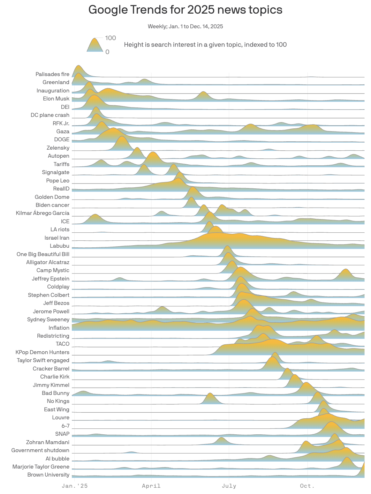
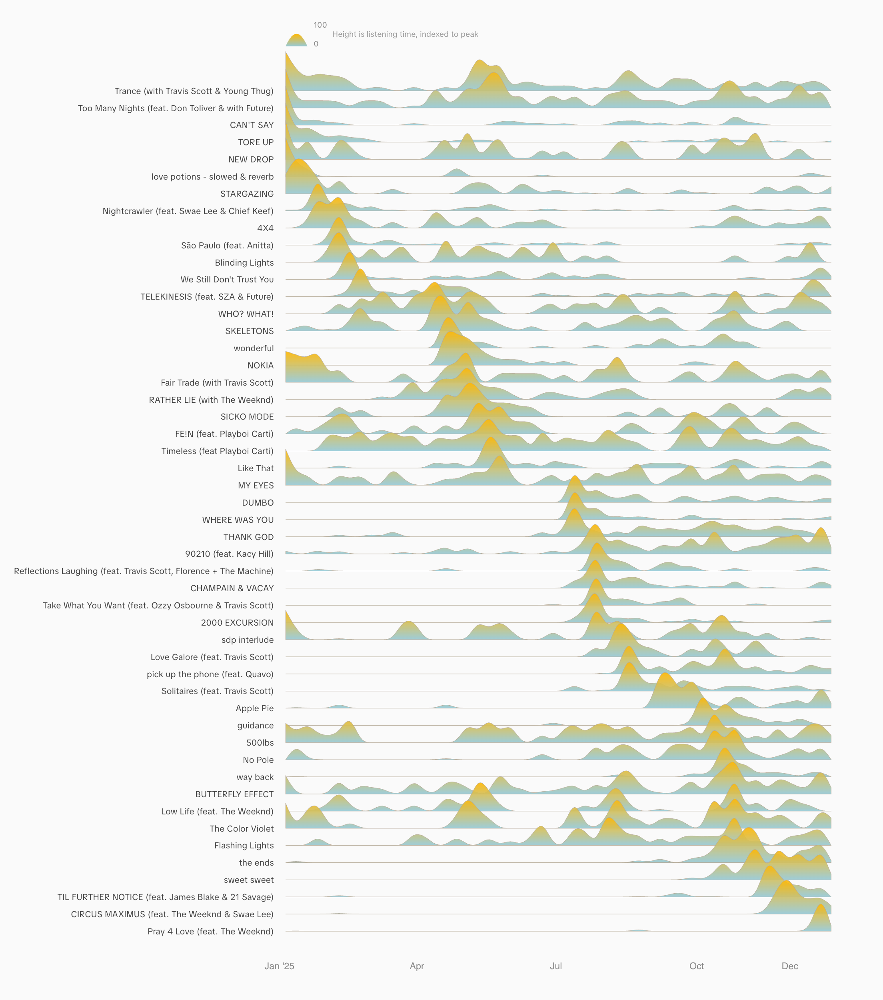
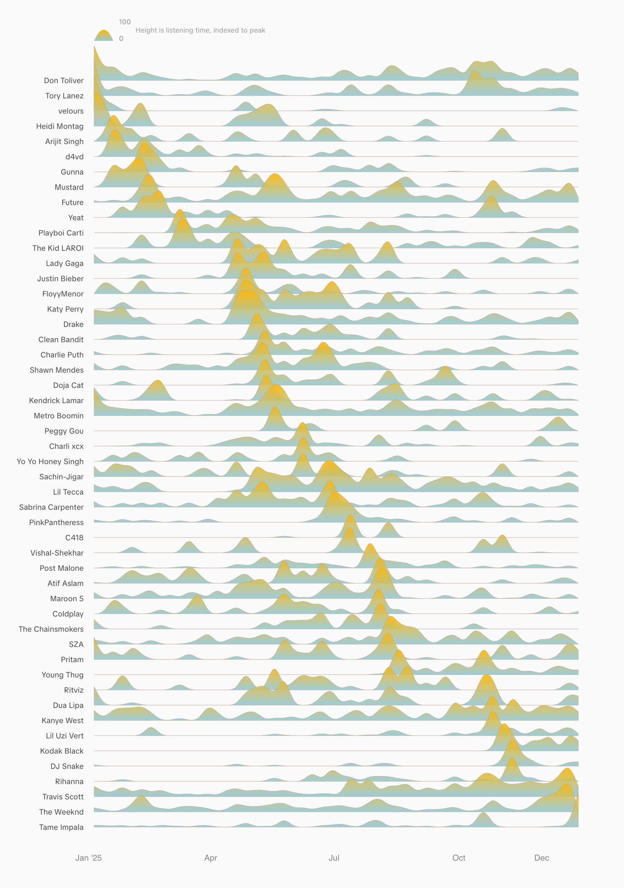

# Spotify Ridgeline

Visualize your Spotify listening trends over time as a ridgeline chart.

## Inspiration

I saw [this visualization](https://x.com/axios/status/2005657768267755888) of trending topics throughout 2025 and wanted to create something similar for my Spotify listening history:



The result is a ridgeline chart that shows your top songs and artists over time, sorted by when they peaked in your listening history.

## Examples

<p float="left">
  
  
</p>

## How to Use

### 1. Request your Spotify data

Go to your [Spotify Privacy Settings](https://www.spotify.com/account/privacy/) and request your data under "Download your data".

### 2. Wait for your data

Spotify takes up to 5 days to prepare your data. You'll receive an email when it's ready to download.

### 3. Upload your streaming history

From the downloaded zip, upload the `StreamingHistory_music_*.json` files. You can select multiple files at once.

**Your data stays private.** All processing happens locally in your browser. Nothing is uploaded to any server.

## Run Locally

```bash
npm install
npm run dev
```

Open [http://localhost:3000](http://localhost:3000) in your browser.

## Tech Stack

- Next.js
- D3.js
- Tailwind CSS
- html-to-image

## Author

Built by [Faisal Sayed](https://x.com/faisal_sayed05)
